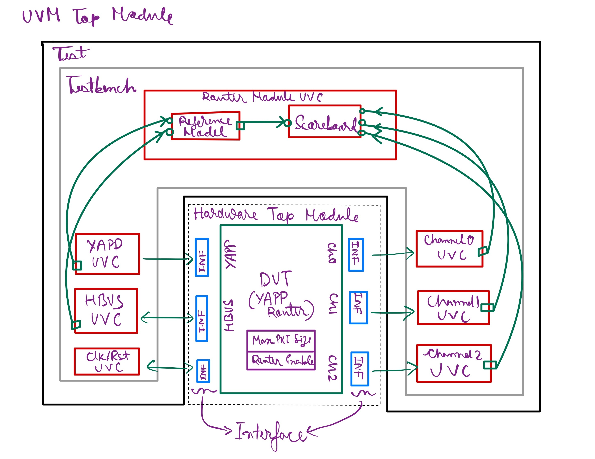

# YAPP UVM Environment  

## Note

The following directories were provided:  
- `router_rtl`  
- `YAPP_env/channel`  
- `YAPP_env/clock_and_reset`  
- `YAPP_env/hbus`  

The remaining directories—`YAPP_env/yapp`, `YAPP_env/router_module`, and `YAPP_env/tb` (except `tb/clkgen.sv`)—were created from scratch.  

## Overall Environment

  
